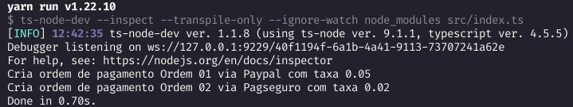

<p align="center">
  <a href="#sobre">Sobre o evento</a>&nbsp;&nbsp;&nbsp;|&nbsp;&nbsp;&nbsp;
  <a href="#jornada">Jornada</a>&nbsp;&nbsp;&nbsp;|&nbsp;&nbsp;&nbsp;
  <a href="#factory">Design Pattern: Factory Method</a>
</p>

<span id="sobre">
  
## :bookmark_tabs: Sobre o evento
O evento "Jornada Dev Pleno", com aulas ministradas por Bruno Braga, teve como
objetivo elucidar algumas questões a cerca de conhecimentos comuns exigidos por
vagas destinadas a desenvolvedores considerados de nível pleno na linguagem
TypeScript, elaborando uma lista com os conceitos básicos necessários para atuar
neste cargo de forma eficiente e tranquila.

<span id="jornada">

## :railway_track: Jornada

Segundo Bruno, o desenvolvedor pleno se apoia principalmente em 4 pilares:

> - **Linguagem TypeScript**: entender bem da linguagem e todos os recursos que ela
>   proporciona nativamente para resolução de problemas <br>
> - **Princípios S.O.L.I.D**: boas práticas utilizando TS <br>
> - **Design Patterns**: conhecer alguns design patterns para melhor organização de
>   código visando fácil manutenção e entendimento <br>
> - **Arquitetura de software**: entender as estruturas de camadas de uma aplicação
>   e como podem ser agrupadas

Onde alguns conceitos a serem dominados dentro de cada um desses pilares são:

### :red_circle: Linguagem TypeScript

- [ ] Tipos primitivos
- [ ] Union Types
- [ ] Interfaces
- [ ] Classes
- [ ] Literal Types
- [ ] Enums
- [ ] Generics
- [ ] Utility Types
  - [ ] Partial
  - [ ] Required
  - [ ] Readonly
  - [ ] Pick
  - [ ] Omit

### :yellow_circle: Princípios SOLID

- [ ] Single Responsability Principle
- [ ] Open/Closed Principle
- [ ] Liskov Substitution Principle
- [ ] Interface Segregation Principle
- [ ] Dependency Inversion Principle

### :large_blue_circle: Design Patterns

- [ ] Criacionais
  - [ ] Factory Method
  - [ ] Abstract Factory
  - [ ] Singleton
- [ ] Estruturais
  - [ ] Adapter
  - [ ] Decorator
  - [ ] Facade
- [ ] Comportamentais
  - [ ] Observer
  - [ ] Iterator
  - [ ] Strategy

### :brown_circle: Arquitetura de Software

- [ ] MVC
- [ ] Clean Architecture
- [ ] DDD
- [ ] Event Driven Architecture

<span id="factory">

## :hammer_and_wrench: Design Pattern: Factory Method

Design Pattern (padrão de projeto) apresenta soluções generalistas para problemas
recorrentes durante o desenvolvimento de um software, por isso há uma gama deles,
cada qual atendendo a necessidades específicas observadas em diferentes situações.
<br><br>
Neste evento o Design Pattern exemplificado na prática foi o **Factory Method**
(onde os códigos podem ser encontrados no arquivo `index.ts` dentro da pasta
`src` deste repositório), foi aplicado na seguinte situação:

### Situação e solução

Um e-commerce só tem opção de pagamento por Paypal, porém é necessário adicionar
a opção pelo Pagseguro. Na análise do código foi observado que tudo relacionado
a pagamento estava em uma classe "MetodoPagamento", já que não havia motivo para
várias classes e subclasses só para uma opção de pagamento, mas continuar o
desenvolvimento apenas com uma classe dessa forma acarretaria em um código mais
complexo e "cheio de ifs", onde a cada novo método, novas condições teriam de
ser criadas em uma única classe, nos mesmos métodos, como o exemplo abaixo:

```typescript
class MetodoPagamento {
  pagar(pagamento: string, orderId: string) {
    if ((pagamento = 'paypal')) {
      // código relacionado ao pagamento com paypal
    } else if ((pagamento = 'pagseguro')) {
      // código relacionado ao pagamento com pagseguro
    } else if ((pagamento = 'pix')) {
      // código relacionado ao pagamento com pix
    } else if ((pagamento = 'boleto')) {
      // código relacionado ao pagamento com boleto
    }
  }

  reembolsar(pagamento: string, orderId: string) {
    if ((pagamento = 'paypal')) {
      // código relacionado ao pagamento com paypal
    } else if ((pagamento = 'pagseguro')) {
      // código relacionado ao pagamento com pagseguro
    } else if ((pagamento = 'pix')) {
      // código relacionado ao pagamento com pix
    } else if ((pagamento = 'boleto')) {
      // código relacionado ao pagamento com boleto
    }
  }
}
```

Para evitar isso foi aplicado o Factory Method, que sugere a criação de:

- uma interface para as classes de pagamento

```typescript
interface PaymentMethod {
  tax: number;
  createPayment(orderId: string): boolean;
  refounfPayment(orderId: string): boolean;
}
```

- uma classe abstrata para criação dos objetos dessas classes, imaginando que
  depois de meses fosse preciso adicionar proriedades ao construtor do pagamento
  com pix, ao invés de mudar em várias áreas do código onde a classe do pix tinha
  sido instanciada, muda somente em um local, na classe concreta que extende a
  classe abstrata que cria um objeto daquele pagamento. Essa classe abstrata para
  criação de objetos é chamada de fábrica (factory), e o objeto (instância da classe
  que implementou a interface), é chamada de produto.

```typescript
abstract class PaymentMethodFactory {
  abstract create(): PaymentMethod;
}
```

Assim são criadas as classes concretas baseadas na interface e na classe abstrata
para cada novo pagamento que vier a ser acrescentado, como no exemplo abaixo:

```typescript
class PaypalMethod implements PaymentMethod {
  tax: number = 0.05;

  createPayment(orderId: string): boolean {
    // do something
    console.log(
      `Cria ordem de pagamento ${orderId} via Paypal com taxa ${this.tax}`
    );
    return true;
  }

  refounfPayment(orderId: string): boolean {
    // do something
    console.log(`Reemvola a ordem de pagamento ${orderId} via Paypal`);
    return true;
  }
}

class PaypalMethodFactory extends PaymentMethodFactory {
  create(): PaymentMethod {
    return new PaypalMethod();
  }
}
```

Já para o uso dessas classes (o uso dos objetos em código), temos o exemplo a seguir:

```typescript
// Código cliente
function clientCode() {
  let paymentMethod: PaymentMethod;

  // Paypal payment
  const paypalMethodFactory = new PaypalMethodFactory();
  paymentMethod = paypalMethodFactory.create();
  paymentMethod.createPayment('Ordem 01');

  // Pagseguro payment
  const pagseguroMethodFactory = new PagseguroMethodFactory();
  paymentMethod = pagseguroMethodFactory.create();
  paymentMethod.createPayment('Ordem 02');
}

clientCode();
```
  
<p align="center">
  
</p>

<hr>

| **PRÓS**                                                                                                                                                                                                                                                                                                                                                                                                                                                                                                                                          | **CONTRAS**                                                                                                          |
| :-------------------------------------------------------------------------------------------------------------------------------------------------------------------------------------------------------------------------------------------------------------------------------------------------------------------------------------------------------------------------------------------------------------------------------------------------------------------------------------------------------------------------------------------- | :--------------------------------------------------------------------------------------------------------------- |
| **Evita acoplamentos firmes entre o criador e seus produtos concretos** (tem uma factory para cada pagamento) <br><br> **Corrobora com o princípio de responsabilidade única.** <br> Pode mover o código de criação do produto pra um único local,facilitando a manutenção (se algo mudar, só impacta na alteração de código em um lugar só) <br><br> **Corrobora com o princípio aberto/fechado.** <br> Introduzir novos tipos de produtos no programa sem quebrar o código já existente (adicionar/remover pagamentos sem interferir no que já existia) | O código pode se tornar mais complicado por conta da criação de muitas novas subclasses que sustentarão o padrão |

[](https://www.linkedin.com/in/mariagabrielareis/)
